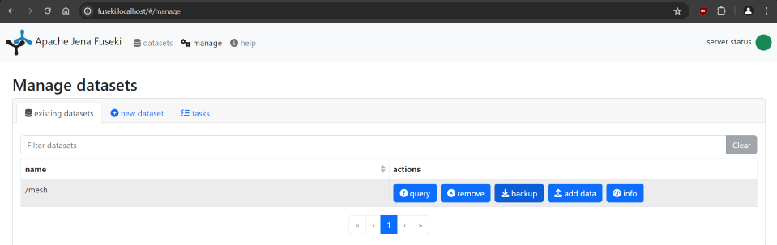

# MTW-MeSH-Docker <!-- omit from toc -->

[Docker Compose](https://github.com/docker/compose) file to manage the build and deployment of [MTW-MeSH](https://github.com/filak/MTW-MeSH), an app developed for the National Medical Library ([NML](https://nlk.cz/), Prague, Czech Republic) for the translation of MeSH vocabulary ([Medical Subject Headings](https://www.nlm.nih.gov/mesh/)).

This Compose file make uses of this [Jena Fuseki docker image](https://github.com/stain/jena-docker/tree/master/jena-fuseki).

---

This repository has three branches :

- [main](https://github.com/Inserm-IST/MTW-MeSH-Docker/tree/main): base configuration without reverse proxy
- [traefik](https://github.com/Inserm-IST/MTW-MeSH-Docker/tree/traefik): using [traefik](https://github.com/traefik/traefik) as reverse proxy
- [caddy](https://github.com/Inserm-IST/MTW-MeSH-Docker/tree/caddy): using [caddy](https://github.com/caddyserver/caddy) as reverse proxy

---

**Contents**

- [Installation](#installation)
- [Initial setup](#initial-setup)
  - [Edit the default configuration](#edit-the-default-configuration)
    - [Edit the mtw-dist.ini file](#edit-the-mtw-distini-file)
    - [Change the default password](#change-the-default-password)
  - [Build the image](#build-the-image)
  - [Loading the MeSH datasets](#loading-the-mesh-datasets)
    - [Validate the datasets](#validate-the-datasets)
- [Run MTW](#run-mtw)
- [Annual MeSH Updates](#annual-mesh-updates)
  - [Backup your MeSH dataset using the Fuseki interface](#backup-your-mesh-dataset-using-the-fuseki-interface)
  - [Download the official MeSH RDF dataset](#download-the-official-mesh-rdf-dataset)
  - [Validate the datasets with riot](#validate-the-datasets-with-riot)
  - [Extract the translation from the backup using mesh-nt2trx tool](#extract-the-translation-from-the-backup-using-mesh-nt2trx-tool)
  - [Delete the old MeSH dataset](#delete-the-old-mesh-dataset)
  - [Stop MTW and Fuseki containers](#stop-mtw-and-fuseki-containers)
  - [Load the MeSH datasets](#load-the-mesh-datasets)
  - [Update MTW config file for new target year/period](#update-mtw-config-file-for-new-target-yearperiod)
  - [Clear the MTW cache](#clear-the-mtw-cache)
  - [Restart MTW](#restart-mtw)
- [Credits](#credits)

---

## Installation

Install [Docker Desktop](https://www.docker.com/products/docker-desktop) for Windows and macOS.

Clone the repository:

```bash
git clone https://github.com/Inserm-IST/MTW-MeSH-Docker.git
```

 Move into the new directory :

```bash
 cd MTW-MeSH-Docker/
```

---

## Initial setup

These operations are only necessary before the first launch.  
All modified files are saved to volumes, so as long as the volumes are persisted (including moving to a new release, removing the containers etc.) it's not necessary to re-run these operations.

### Edit the default configuration

#### Edit the mtw-dist.ini file

**Important values are marked with !**  
Modify the values for your personal configuration, including `TARGET_YEAR`, `TARGET_LANG`, `TARGET_NS` etc.  

Make sure this line is uncommented :  
`SPARQL_HOST = http://jena_fuseki:3030/`

For more details, refer to [MTW-MeSH Wiki](https://github.com/filak/MTW-MeSH/wiki/Installation-on-Windows#mtw-binaries)

#### Change the default password

A default value is provided for the admin pass for both MTW and Jena Fuseki as a secret in the `admin_settings.txt` file.

> :warning: **Warning:** Make sure to change this value and not to reveal then content of this file (via *git* for example).

### Build the image

```bash
docker compose build
```

### Loading the MeSH datasets

For more details see: [Loading MeSH datasets](https://github.com/filak/MTW-MeSH/wiki/Loading-MeSH-datasets)

Copy the official annual RDF dataset and your RDF translation dataset to the `./mesh-data/` directory.

#### Validate the datasets

Make sure to validate your `mesh.nt.gz` and `mesh-trx_YYYY-MM-DD.nt.gz` file with `riot`.  

You can for example use the [Jena Docker image](https://github.com/stain/jena-docker/tree/master/jena) :

```bash
docker run --rm \
--volume /$(pwd)/mesh-data/:/rdf \
stain/jena riot --validate mesh.nt.gz mesh-trx_YYYY-MM-DD.nt.gz
```

A special service called `staging` is part of the Compose file to load the MeSH data into the triple store.  

> :warning: **Warning:** All the data already present in the Mesh dataset in Jena Fuseki will be lost.

Type the following command:

```bash
docker compose run --rm staging
```

---

## Run MTW

```bash
docker compose up -d
```

- Using Traefik/Caddy as reverse proxy:
  
  - MTW should be accessible on: <http://mtw.localhost/>  
  - Jena fuseki on: <http://fuseki.localhost/>

- Without reverse proxy:

  - MTW should be accessible on: <http://127.0.0.1:55930/mtw/>  
  - Jena fuseki on: <http://127.0.0.1:3030/#/>

---

## Annual MeSH Updates

For more details see: [MeSH Annual Updates](https://github.com/filak/MTW-MeSH/wiki/MeSH-Annual-Updates)

### Backup your MeSH dataset using the Fuseki interface

In the fuseki interface, in the `Manage` tab, click on the `backup` button for the mesh dataset.



You should now have a backup file `mesh_YYYY-MM-DD_....nt.gz` in the `backups` folder of the `mtw_fuseki-data` volume.

If we want to save this `mesh_YYYY-MM-DD_....nt.gz` file from the Docker volume to our local `mesh-data` folder, we can use the following command:

```bash
docker cp mtw-jena_fuseki-1:/fuseki/backups/mesh_YYYY-MM-DD_....nt.gz ./mesh-data/
```

<!-- ```bash
docker run -it --rm \
--volume mtw_fuseki-data:/fuseki \
--volume /$(pwd)/mesh-data/:/mesh-data \
--workdir //fuseki stain/jena \
cp backups/mesh_YYYY-MM-DD_....nt.gz //mesh-data/
``` -->

### Download the official MeSH RDF dataset

```bash
curl https://nlmpubs.nlm.nih.gov/projects/mesh/rdf/mesh.nt.gz --ssl-no-revoke -O
```

### Validate the datasets with riot

Validate the backup `mesh_YYYY-MM-DD_....nt.gz` and the official MeSH RDF dataset `mesh.nt.gz` with `riot`.  

If the `mesh_YYYY-MM-DD_....nt.gz` and  `mesh.nt.gz` files are stored in our local `mesh-data` folder, we can use the [Jena Docker image](https://github.com/stain/jena-docker/tree/master/jena) :

```bash
docker run --rm \
--volume /$(pwd)/mesh-data/:/rdf stain/jena \
riot --validate mesh.nt.gz mesh_YYYY-MM-DD_....nt.gz
```

### Extract the translation from the backup using mesh-nt2trx tool

```bash
docker run -it --rm \
--volume /$(pwd)/mesh-data/:/rdf \
--workdir //rdf mtw-server \
python3 //app/tools/mesh-nt2trx.py mesh_YYYY-MM-DD_....nt.gz
```

You should now have a translation file `mtw-trx_YYYY-MM-DD.nt.gz` in your local `mesh-data` folder.

### Delete the old MeSH dataset

In the fuseki interface, in the `Manage` tab, click on the `remove` button for the mesh dataset.


<!-- ```bash
docker run -it --rm --volume mtw_fuseki-data:/fuseki --workdir //fuseki stain/jena bash
```

```bash
rm -r databases/mesh/ indexes/mesh
``` -->

### Stop MTW and Fuseki containers

```bash
docker compose down
```

### Load the MeSH datasets

Follow the steps in [Loading the MeSH datasets](#loading-the-mesh-datasets)

### Update MTW config file for new target year/period

```bash
docker run -it --rm \
--volume mtw_mtw-data:/app/instance/ \
--workdir //app/instance/ \
mtw-server bash
```

```bash
apt-get update && apt-get install nano
```

```bash
nano conf/mtw-dist.ini
```

Update the values `TARGET_YEAR`, `PREV_YEAR_DEF`, `PREV_YEARS` according ro your configuration.

Save and exit: `CTRL+S`, `CTRL+X`

### Clear the MTW cache

```bash
rm cache/*
```

```bash
exit
```

### Restart MTW

```bash
docker compose up -d
```

---

## Credits

- Thanks to [filak](https://github.com/filak) for his work on the [MTW app](https://github.com/filak/MTW-MeSH), his assistance in deploying it and his help into writing this Docker Compose file.

- [JulienBacquart](https://github.com/JulienBacquart)
